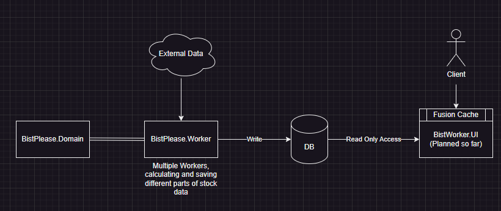

# Bist Please

A stock analysis application, based on financials and price. It's not a real time app, as we'll update the data daily. It is under development right now.

## Architecture 

# Domain

1. We have companies, their financials, and calculations based on financials. 
2. Instead of sector, we'll go with tags. For instance most websites list companies based on some sector, but even though they're part of the same sector, they could be doing very different things, so we should be more elastic about that.